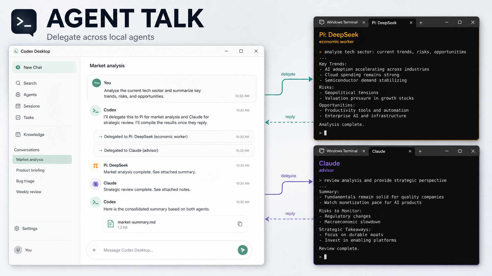
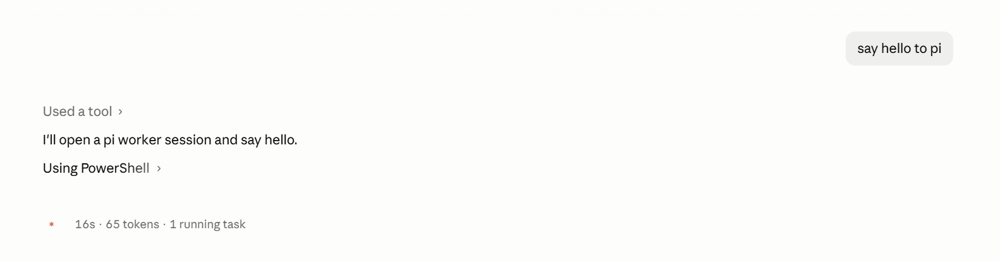
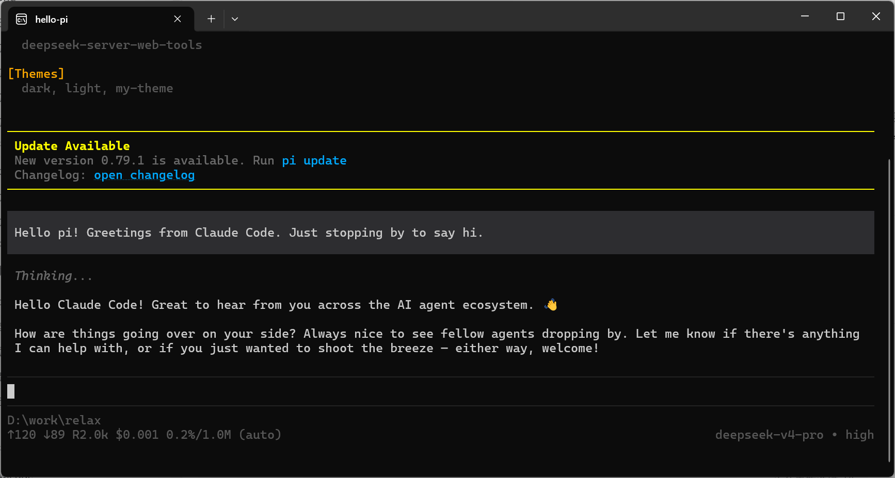
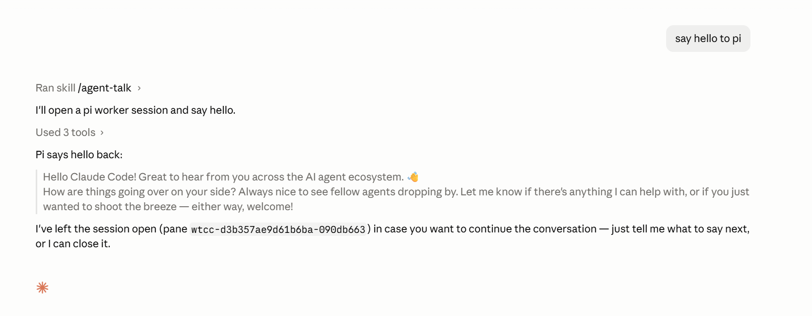

# Agent Talk Skill



Agent Talk is the simplest way on Windows to let different local AI agents talk
to each other.

You can use it from any AI agent that supports skills, including Claude, Codex
Desktop, Codex CLI, or other terminal-based agents. Once installed, your main
agent can open another local agent in Windows Terminal, send it a message, wait
for the reply, and bring the result back into the conversation.

Main agent: any AI agent that supports skills.

Target agents supported: Codex, Claude, Pi, and Antigravity / `agy`.

## Installation

Agent Talk is a skill. Ask your AI agent to install it:

```text
Please install the agent-talk skill from:
https://github.com/earth202509/agent-talk
```

## First Use

If you already have Pi installed, or another supported CLI such as Claude Code,
Codex CLI, or Antigravity CLI, try this in your main agent:

```text
say hello to pi
```



Your agent will use the `agent-talk` skill to open a Windows Terminal session,
enter Pi, send the message, wait for the reply, and return the result.





## For Developers

### Requirements

- Windows
- PowerShell 5.1 or newer
- Windows Terminal
- Any local agent CLIs you want to use, available on `PATH`

### Repository Layout

- `src/` - skill source, scripts, adapters, and strategy notes.
- `src/SKILL.md` - skill entry point.
- `src/scripts/talkie.ps1` - main command surface used by the skill.
- `src/scripts/agents/` - agent-specific launch, submit, status, and reply parsing adapters.
- `src/scripts/terminals/` - Windows Terminal + ConPTY transport.
- `tests/` - PowerShell tests for adapters, reply extraction, deployment, and script parsing.
- `scripts/deploy-skills.ps1` - deploys the skill to local agent skill directories.

Runtime state under `src/state/` is intentionally ignored and should not be
committed.

### Test

```powershell
powershell -NoProfile -ExecutionPolicy Bypass -File .\tests\run-tests.ps1
```

### Manual Deploy

Deploy to the default local skill directories:

```powershell
.\scripts\deploy-skills.ps1
```

Deploy to selected targets only:

```powershell
.\scripts\deploy-skills.ps1 -SkipClaude -SkipGemini -SkipPi
```

Override a target directory:

```powershell
.\scripts\deploy-skills.ps1 -CodexRoot "$env:USERPROFILE\.codex\skills"
```

### Command Surface

All skill operations go through `src/scripts/talkie.ps1`.

Common commands:

```powershell
.\src\scripts\talkie.ps1 list-agents json
.\src\scripts\talkie.ps1 new-session codex "review-helper" "D:\repo"
.\src\scripts\talkie.ps1 send <session-id> "hello"
.\src\scripts\talkie.ps1 wait-reply <session-id>
.\src\scripts\talkie.ps1 list-sessions
.\src\scripts\talkie.ps1 kill-session <session-id>
```

### Configuration

Useful environment variables:

- `AGENT_TALK_SCROLLBACK_ROWS` - scrollback rows used when collecting replies.
- `AGENT_TALK_STABLE_IDLE_MS` - idle window for new-session readiness.
- `AGENT_TALK_WAIT_REPLY_STABLE_IDLE_MS` - idle window for reply collection.
- `AGENT_TALK_LOG_TAIL_BYTES` - maximum log tail bytes read while extracting replies.
- `AGENT_TALK_TERMINAL_TOOL` - terminal backend override.
- `WT_CONPTY_CC_STATE_DIR` - alternate runtime state directory for tests or debugging.

### Development Notes

- Keep `src/SKILL.md` concise and move optional details into scripts or references
  only when they are useful.
- Do not commit runtime state from `src/state/`.
- Prefer focused tests in `tests/agent-talk.tests.ps1` for command and adapter
  behavior.

## License

MIT. See `LICENSE`.
